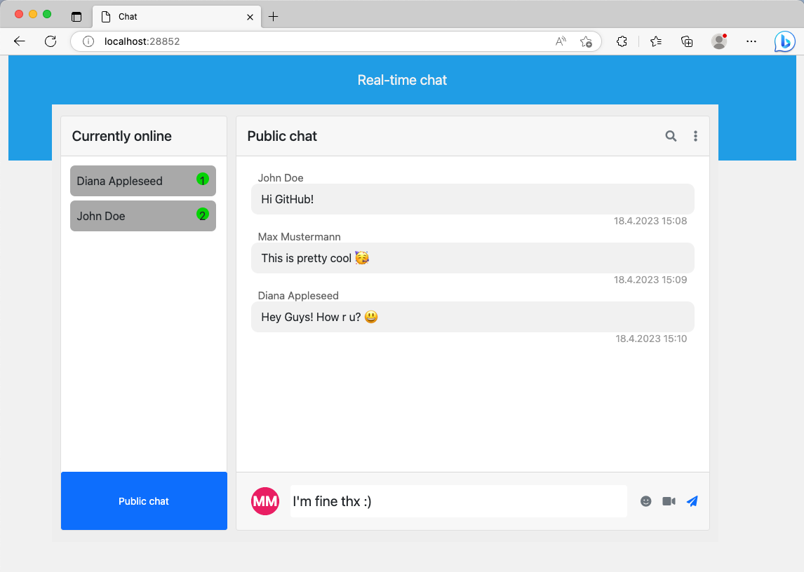

# Real-time chat

This is a simple chat application that uses Spring Boot, WebSockets, STOMP, and MySQL to allow users to send and receive
real-time messages.



## Requirements

To run this application, you will need:

- Java 17 or later
- Gradle 7.0 or later
- MySQL* 8.0 or later

_*You can use MongoDB instead of MySQL. See the [docs](docs/CONFIG.md#using-mongodb) for more information._

## Installation Guide

1. Clone this repository to your local machine using

```bash
git clone https://github.com/dan-koller/real-time-chat.git
```

2. Navigate to the root directory of the project.

```bash
cd real-time-chat
```

3. Set up your database and the environment variables. Take a look at the [docs](docs/CONFIG.md#using-mysql) for more
   information.

4. Build the project using Gradle.

```bash
./gradlew build
```

5. Run the application.

```bash
./gradlew bootRun
```

## Details about the App

Once the application is running, you can access it by navigating to http://localhost:28852 in your web browser.

The home page will display a form where you can enter your username and join the chat room. Once you have joined the
chat room, you can send and receive messages in real-time.

The application uses WebSockets and the STOMP protocol to facilitate real-time communication between clients and the
server. When a user sends a message, the message is stored in the MySQL database and broadcast to all other users in the
chat room.

The application also includes basic security features to prevent unauthorized access. Users must be authenticated in
order to join the chat room, and usernames are checked to ensure that they are unique.

If you want to rebuild this project from scratch, you can take a look at the provided [resources](docs/RESOURCES.md).
You can find FAQs [here](docs/FAQ.md).

## License

This project is licensed under the MIT License. See the LICENSE file for details.